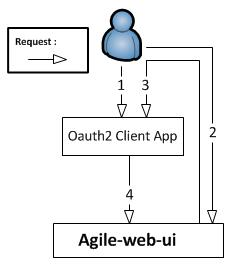

# AGILE IDM OAauth2 client example


This repository contains examples of minimal node js web applications that use AGILE IDM for different purposes.
All the branches have an oauth2 client, hence the name of the repository. Also, this application is just an example and not meant for use in production systems. It does not include proper validation input when executing calls to IDM, and therefore may be vulnerable to Web attacks. 

#Branches

This repository contains several branches depending on the functionalities that are showcased:

* client: a minimalistic application that uses AGILE IDM as its identity provider, and displays user information  (user information, and token).
* api-client: an extended version of the client application, but on top it also offers some basic functionality to register entities on identity management.

## Quick Setup

### Web-UI configuration

This example assumes a certain kind of entity set (defined in the configuration of agile-idm-web-ui). So, please copy the file in agile-ui-conf in the conf directory in agile-idm-web-ui for consistency.

### Create User

First of all, we need to create the first user with IDM, if it not already created:
For this, execute the following command in the scripts folder of agile-idm-web-ui

```
  node createUser.js --username=bob --password=secret  --auth=agile-local
```

### Create the Oauth2 client (so that it matches the configuration of this example)

```
node createClient.js --client=MyAgileClient2 --name="My first example as IDM client" --secret="Ultrasecretstuff" --owner=bob --auth_type=agile-local --uri=http://localhost:3002/auth/example/callback
```
Alternatively if you have already logged in with a token and just want to use the rest api, the following line should work assuming you place the token on the TOKEN variable in a shell.
```

curl -X POST -H "Content-type: application/json" -H "Authorization: bearer $TOKEN" -d '{"name":"MyAgileClient2","clientSecret":"theclientsecret", "redirectURI": "http://agilegw.local:3002/auth/example/callback"}' 'http://agilegw.local:3000/api/v1/entity/client/MyAgileClient2'
```


### RUN Identity Management

Then run identity management by executing this in the root of the agile-idm-web-ui folder:

```
  node app.js
```

### RUN this example

Run this example by executing this in the root of the current project:

```
  node index.js
```


## Example Overview

Assuming that an oauth client has been registered in AGILE IDM, the flow to obtain an access token for any AGILE user is depicted in the following picture.
<table align="center">
	<tr>
		<td></td>
	</tr>
	<tr align="center">
		<td>
			AGILE IDM interaction with Oauth2 clients
		</td>
	</tr>
</table>
From step 1 to 4, the authentication between IDM and the Oauth2 client occurs; however, it must be noted that in case AGILE IDM relies on another identity provider, such as google, to authenticate the user, additional steps will take place between step 2 and 3. In each step the following actions take place:

1. the user opens the Oauth2 client application, but he/she is not authenticated yet. 

2. the Oauth2 client App redirects the user to AGILE IDM presenting its client id and a redirect URL that will be called by IDM on successful authentication of the user (if this URL matches the registration of the oauth client). Subsequently, the user authenticates with AGILE IDM using any of the authentication providers available.

3. On succesful user authentication, IDM redirects the user with an authorization code (valid only for this client) to the client callback endoint.

4. Once the Oauth2 client application has received the authorization code, it calls IDM providing the authorization token along with its client id and client secret, in order to exchange the authorization code for a valid access token for this user. Once IDM returns a token (if id and secret are valid), it will delete the authorization code afterwards. From this point on, the application can use this token to interact with IDM, or with any other AGILE component that has been integrated with AGILE IDM.


In the case of the more complex example (api-client branch), there will be subsequent requests from the Oauth2 client app to AGILE IDM, which contain and access token, using a bearer authorization token in HTTP, to handle entities in AGILE IDM.

## Project Structure

The code for the oauth2 client example is structured in the following folders:
* **certs**: self-signed certificates used for TLS connection (for security reasons proper certificates should be used)
* **conf**: configuration of the current application. This includes the following configurations:
 * **oauth2**: contains the client configuration, which includes callback url to receive tha authorization code from AGILE IDM, the authentication endpoints, cliend id and client secrets. All these values are already consistent with the example setup step by step guide, i.e. the proper cliet was generated in the set up phase. 
 * **site**: ports to run in http and in https as well as certificates used for TLS (by default pointing to the ones available in the certs folder)
  * **idm**: this configuration property is  needed in the api-client example, to build the url to the REST Entity API of AGILE IDM. In the case of the simplest client which just uses IDM as an identity provider this configuration is not present.
* **db**: This folder contains a minimalistic implementation of an in-memory database for tokens and users. These tokens and users are generated by the passport authentication strategy user (oauth2 client). On the one hand, having this in-memory database makes it easy to run the example due to the lack of additional installation of a dabatabase component. On the other hand, this may not be suitable for production environments because users are logged out whenever this example client is restarted.
* **passport**: this folder includes two building blocks of passport. 
 * **the user serializer** is required to keep the user id in the session and provides a mapping to the user database. This component is required by passport to map users (who have been loged in) to their respective sessions. In this particular example, the session is ultimately implemented as a cookie between the web browser and the client. 
 * **the passport strategy** is used to authenticate users with AGILE IDM, by relying on it to behave as an Oauth2 provider, and it also overrides the exchange of an access token by the user's information. The latter has been implemented in the *profileFromIDM* function.
* **routes**: this folder includes the proper express code to mount the routes for the oauth2 authorization code flow, the routes to revtrieve user information. And optionally, in the case of the more complex example that also consumes the REST Entity API of AGILE IDM, it includes the routes required to receive requests from the browser. In turn these files (called groups, entities, and users denpending on their particular responsibilities) take care of executing the REST calls to AGILE IDM, and to render the proper views to the user in HTML form.
* **views**: includes the ejs views, which comprise a basic html template to represent the information to the user in HTML.
* **web-ui-conf**: this folder contains a configuration file that should be placed in AGILE IDM, in order to be able to register entities as shown in the tutorial video (URL TBD).

Also the root folder contains the following files:
* index.js: **main** file to be run, to try the example.
* package.json: used to specify project name, url and dependencies
* Gruntfile.js: file used to format and verify code structure. Also it checks for jshint errors in javascript
* .jsbeautify and .jshintrc: configurations for beautify and jshint used by the grunt file

To print debugging information of IDM, please have a look at the agile-idm-web-ui here https://github.com/Agile-IoT/agile-idm-web-ui/blob/master/README.md

